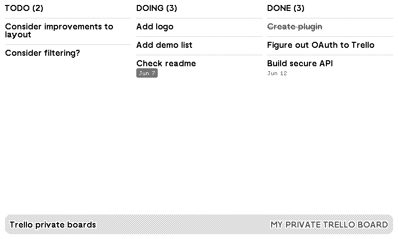

# trmnlello - Trello for private boards

A [TRMNL](https://trmnl.com) plugin that displays your Trello kanban board on your e-ink device. Shows all lists and cards including completed ones, with due dates.

## Don't have a TRMNL yet?

TRMNL is a low-power e-ink dashboard for calendars, to-dos, and plugins like this one. If you'd like one, using my referral link gets you a discount and sends a little my way at no extra cost to you:

**[trmnl.com?ref=eggerton](https://trmnl.com?ref=eggerton)**

## Installing

1. In your TRMNL dashboard, find **Trello for private boards** in the plugin marketplace and click **Install**
2. You'll be redirected to Trello to authorise read-only access to your boards
3. Pick which board to display
4. Your device will show the board on its next refresh

To switch boards later, use the **Configure** button on the plugin settings page.

## Display

The board is shown as a kanban — one column per list, cards stacked within each. Due dates are shown in red if overdue (gray on black-and-white devices). Completed cards (due date ticked, or all checklist items checked) are shown with a strikethrough.

Due dates are displayed in your local timezone, taken from your TRMNL device settings.

The plugin supports all four TRMNL layout sizes (full screen, half vertical, half horizontal, and quadrant).

## Limitations

- Only tested with up to 4 columns — boards with more lists may display poorly
- Boards with a large number of cards per column will be truncated; only the first several cards are shown

## Trello permissions

When you connect Trello, you will be asked to grant **read-only** access. This allows the plugin to:

- Read the names and lists on your boards
- Read card titles, labels, and due dates

It cannot create, edit, or delete anything in Trello. It cannot access your Trello account details, email address, or any boards you don't explicitly choose to display.

The token is scoped to `read` access and does not expire — this avoids you needing to reconnect periodically. It is stored securely and deleted when you uninstall the plugin or after 90 days of inactivity.

## Privacy & data

This plugin runs on [Cloudflare Workers](https://workers.cloudflare.com/) — a serverless platform with data centres worldwide. Your data is stored in Cloudflare KV, a key-value store hosted by Cloudflare.

- Read-only Trello access is requested — the plugin cannot create, edit, or delete anything in Trello
- Your Trello OAuth token is stored in Cloudflare KV (hosted by the plugin operator) and is never sent to TRMNL — TRMNL only calls the `/markup` endpoint to fetch display content
- Tokens are automatically deleted after 90 days of inactivity, or immediately when you uninstall the plugin

## Acknowledgements

Thanks to [@ucffool](https://github.com/ucffool) who independently created a public Trello board viewer for TRMNL.

## Availability & SLA

This plugin is run on a **best-effort basis with no uptime guarantee**. It is hosted on Cloudflare's **free tier**, which carries **no contractual SLA** — Cloudflare only offers SLAs on its Business and Enterprise plans.

For reference, even on Cloudflare's paid Enterprise tier the published commitments are:

| Component | Published SLA (Enterprise only) |
|-----------|---------------------------------|
| Cloudflare Workers (the app runtime) | 99.99% monthly uptime |
| Cloudflare KV (data storage) | No separately published SLA |
| Trello API (data source) | Governed by Atlassian's own terms |
| TRMNL (device + refresh) | Governed by TRMNL's own terms |

Because the service depends on several components in series, real-world availability is the **product** of all of them, not the best single figure. For example, four dependencies each at 99.9% give a compound availability of roughly `0.999⁴ ≈ 99.6%` — and on the free tier none of these are actually guaranteed at all. In practice the plugin is reliable, but you should treat it as best-effort and not depend on it for anything critical.

You can check the live status and incident history of the underlying platforms here:

- **Cloudflare:** [cloudflarestatus.com](https://www.cloudflarestatus.com) — Workers & KV status (filter to the "Workers" and "Workers KV" components)
- **Trello:** [trello.status.atlassian.com](https://trello.status.atlassian.com)
- **TRMNL:** [trmnl.statuspage.io](https://trmnl.statuspage.io)

Sources: [Workers SLA](https://www.cloudflare.com/workers-service-level-agreement/), [Workers pricing](https://developers.cloudflare.com/workers/platform/pricing/), [KV pricing](https://developers.cloudflare.com/kv/platform/pricing/).

## Disclaimer

This plugin is provided **as-is, without any warranty**. Use at your own risk.

While reasonable precautions are taken (read-only Trello access, encrypted-at-rest storage, automatic token expiry), no security guarantee is made. In the event of a breach of the underlying infrastructure, Trello OAuth tokens stored in Cloudflare KV could be exposed. These tokens grant read-only access to whichever Trello board you selected — they cannot be used to modify or delete your Trello data.

You can revoke access at any time by visiting [https://trello.com/your-account/power-ups](https://trello.com/your-account/power-ups) and removing the Trmnlello authorisation, or by uninstalling the plugin from TRMNL.

The author accepts no liability for any loss or damage arising from use of this plugin.

## Issues

If something isn't working, open an issue on [GitHub](https://github.com/gitstua/trmnlello).
